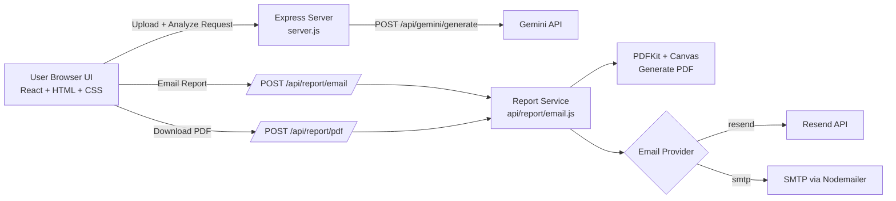

# NeuroCynx

AI-assisted medical report analysis with secure backend inference, downloadable PDF reports, and one-click email delivery.


## Why NeuroCynx

NeuroCynx is designed to make report review fast, private, and actionable:

- Upload medical reports (PDF/images) in a clean, responsive UI.
- Analyze reports through a backend Gemini proxy (API key stays server-side).
- Generate structured insights: summary, care, medication notes, lifestyle guidance, SWOT, and health scores.
- Download a polished PDF report.
- Email reports as PDF attachments using Resend or SMTP.

## Feature Highlights

- Modern React interface (CDN-based, zero frontend build step).
- Dark/light theme support.
- Interactive health radar chart with Chart.js.
- AI follow-up chatbot for report Q&A.
- Professional report emails with branded HTML template.
- Server-side validation and fallback model strategy for Gemini.

## Tech Stack

- Frontend: React 18 (CDN), Babel Standalone, HTML5, CSS3.
- Backend: Node.js, Express.
- AI: Google Gemini API (server proxy + fallback models).
- PDF: PDFKit + Canvas.
- Email: Resend API or SMTP via Nodemailer.
- UI assets: Ionicons, Marked.js, Chart.js.

## Project Structure

```text
NeuroCynx/
├── api/
│   ├── health.js
│   ├── gemini/
│   │   └── generate.js
│   └── report/
│       └── email.js
├── index.html
├── styles.css
├── server.js
├── .env.example
├── package.json
└── README.md
```

## Architecture



## Quick Start

### 1. Prerequisites

- Node.js 18 or newer.
- A Gemini API key.
- One email delivery option:
  - Resend API key, or
  - SMTP credentials.

### 2. Install

```bash
npm install
```

### 3. Configure Environment

Create `.env` from `.env.example` and fill required values.

Required for AI:

```env
GEMINI_API_KEY=your_real_key
```

Choose one email mode:

Resend mode:

```env
EMAIL_PROVIDER=resend
EMAIL_API_KEY=re_your_real_key
EMAIL_FROM=NeuroCynx Reports <your-verified-domain@yourdomain.com>
```

SMTP mode:

```env
EMAIL_PROVIDER=smtp
SMTP_HOST=smtp.example.com
SMTP_PORT=587
SMTP_USER=your_user
SMTP_PASS=your_password
SMTP_FROM=NeuroCynx Reports <reports@example.com>
```

Optional template links:

```env
REPORT_URL=https://neucyn.tech
UNSUBSCRIBE_URL=https://neucyn.tech
```

### 4. Run

```bash
npm start
```

Open: http://localhost:3000

## Demo

Showcase your app flow with a short GIF (recommended 8-20 seconds):

- Hero and theme switch
- Report upload and AI analysis
- Radar chart + SWOT output
- Email report + PDF download

If you add a GIF, place it near the top of this README right after the screenshot for best impact.

## API Endpoints

Local Express server:

- `GET /health`
- `POST /api/gemini/generate`
- `POST /api/report/email`
- `POST /api/report/pdf`

Vercel function routes (under `api/`):

- `GET /api/health`
- `POST /api/gemini/generate`
- `POST /api/report/email`
- `POST /api/report/pdf`

## Email Delivery Notes

- If `EMAIL_PROVIDER` is omitted, backend auto-selects:
  - `resend` when `EMAIL_API_KEY`/`RESEND_API_KEY` exists
  - otherwise `smtp`.
- Keep all credentials server-side only.
- For Resend, use a verified sender in `EMAIL_FROM` for production.

## Security Practices

- Never expose `GEMINI_API_KEY` in frontend code.
- Keep `.env` out of version control.
- Validate all incoming payloads in backend APIs.
- Treat AI-generated output as assistive, not final medical diagnosis.

## Product Disclaimer

NeuroCynx provides AI-assisted insights and does not replace licensed medical professionals. Always consult a qualified clinician for diagnosis and treatment.

## Contributing

1. Fork the repository.
2. Create a feature branch.
3. Make changes with clear commit messages.
4. Open a pull request with a concise summary and test notes.

## License

MIT
