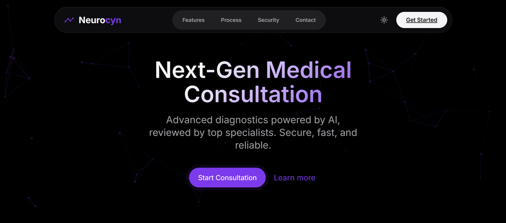

# NeuroCynx - Secure Consultation Platform

NeuroCynx is a modern, secure, and user-friendly platform designed to facilitate private consultations. Built with performance and privacy in mind, it provides a seamless experience for users seeking professional advice.



## 🚀 Features

-   **Secure & Private:** Built with top-tier security standards to ensure user data and conversations remain confidential.
-   **Modern UI/UX:** A clean, responsive interface designed with the latest web aesthetics (Glassmorphism, Inter font).
-   **Dark/Light Mode:** Full support for both dark and light themes for visual comfort.
-   **Responsive Design:** Fully optimized for desktops, tablets, and mobile devices.
-   **Smooth Animations:** Engaging scroll animations for a polished user experience.

## 🛠 Tech Stack

-   **Frontend:** React 18 (via CDN for lightweight deployment), HTML5, CSS3.
-   **Styling:** Custom CSS with CSS Variables, Flexbox/Grid.
-   **Icons:** Ionicons.
-   **Markdown Rendering:** Marked.js.

## 📂 Project Structure

```
NeuroCynx/
├── index.html      # Main application file (contains React components)
├── styles.css      # Core styles and variables
├── script.js       # Helper scripts and hooks
└── README.md       # Project documentation
```

## ⚡ Getting Started

Since this project uses React via CDN, you don't need a complex build step like Webpack or Vite to get it running locally.

### Prerequisites
-   A modern web browser (Chrome, Firefox, Edge, Safari).
-   A local web server (Recommended).

### Running the Project

1.  **Clone the repository:**
    ```bash
    git clone https://github.com/yourusername/NeuroCynx.git
    cd NeuroCynx
    ```

2.  **Open `index.html`:**
    *   You can open the file directly in your browser, but for the best experience (and to avoid CORS issues with some Babel standalone features), use a simple local server.
    *   **Using VS Code Live Server:** Right-click `index.html` and select "Open with Live Server".
    *   **Using Python:**
        ```bash
        # Python 3.x
        python -m http.server 8000
        ```
        Then navigate to `http://localhost:8000`.

## 🤝 Contributing

Contributions are welcome! Please feel free to submit a Pull Request.

1.  Fork the project
2.  Create your Feature Branch (`git checkout -b feature/AmazingFeature`)
3.  Commit your changes (`git commit -m 'Add some AmazingFeature'`)
4.  Push to the Branch (`git push origin feature/AmazingFeature`)
5.  Open a Pull Request

## 📄 License

This project is licensed under the MIT License - see the LICENSE file for details.
